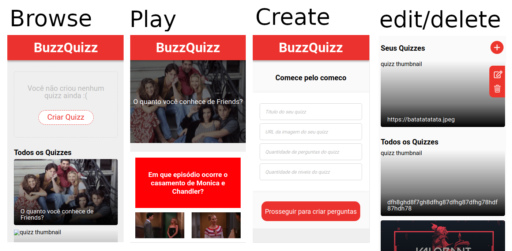

# Buzz-Quizz

The goal of this project is to create an online Quiz platform where the user can browse and play quizzes submitted by other users, as well as creating their own quizzes. The page connects to the API provided by respondeAi and makes use of local storage to store information on which quizzes were created by the current user instead of the community. As a requirement to this project, when someone is playing a quiz and picks an answer to a question, the page will wait 2seconds and scroll to the next question. Please keep this delay in mind. Another delayed scrolling implementation also happens when the user is creating a quiz. The user can also delete and edit their own quizes.

We've decided not to scroll to the question directly below the current one necessarily. Instead, the code will look for the next logical question. Meaning, if a user decides to skip a question, it might scroll up so they can answer the skipped one. Or it might scroll past an already answered question. You can look for the function goToNextQuestion() in play_quizz.js and disable this behavior if you want.

To achieve this, the project makes use of HTML5, CSS3, vanilla JavaScript and the API provided by respondeAi.

BE SURE TO CLEAR YOUR LOCAL STORAGE IF YOU ACCESSED THE DEPLOYED PAGE BEFORE april/24/2021
reason: data structure change

## Built With

- HTML5 , CSS3 , JavaScript
- Windows, Linux

## Live Demo

[Live Demo Link](https://vitorelourenco.github.io/buzz-quizz/)

## Authors

👤 **Victor Mayer**

- GitHub: [@VictorMayer](https://github.com/VictorMayer)
- Twitter: [@](https://twitter.com/)
- LinkedIn: 

👤 **Vitor Emanuel Lourenco**

- GitHub: [@vitorelourenco](https://github.com/vitorelourenco)
- Twitter: [@Vitorel](https://twitter.com/Vitorel)
- LinkedIn: [vitoremanuellourenco](https://www.linkedin.com/in/vitoremanuellourenco/)

## 🤝 Contributing

Contributions, issues, and feature requests are welcome!

Feel free to check the [issues page](https://github.com/vitorelourenco/buzz-quizz/issues).

## Show your support

Give a ⭐️ if you like this project!

## Acknowledgments

- RespondeAi (https://www.respondeai.com.br/)
- The Odin Project (https://www.theodinproject.com/)

## 📝 License

This project is [MIT](lic.url) licensed.

